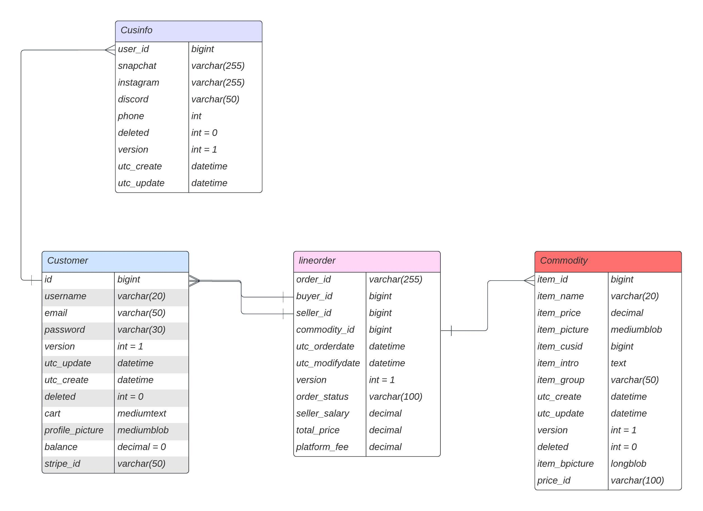

# Fulwe (Second-Hand Goods Trading Platform)

Welcome to the Fulwe, Second-Hand Goods Trading Platform, a dynamic e-commerce solution designed to streamline transactions for college students seeking to buy and sell second-hand items.

## Project Overview

This platform was developed using Java Spring Boot, Bootstrap, and Thymeleaf, combining robust technology to provide a seamless user experience. Whether you're a student looking for affordable items or aiming to declutter, our platform offers a user-friendly interface and secure transactions.

## Key Features

- **Dynamic E-commerce:** Facilitate buying and selling of second-hand items among college students.
- **Full Lifecycle Management:** Solely responsible for the project's entire lifecycle, from inception to deployment on AWS using Docker with a Jenkins CI/CD pipeline.
- **Security Measures:** Implemented robust security with Shiro and Spring Security, ensuring a safe and secure environment.
- **Payment Integration:** Integrated Stripe for secure and reliable payment processing.
- **Efficient Project Management:** Effectively managed the project using Git, resulting in a 30% reduction in development time.

## Technical Stack

- **Backend:** Java Spring Boot
- **Frontend:** Bootstrap, Thymeleaf
- **Database:** MySQL with MyBatis for optimized data access times.
- **Deployment:** AWS, Docker, Jenkins CI/CD pipeline
- **Security:** Shiro, Spring Security
- **Payment Integration:** Stripe

## System architecture diagram

## Business logic

Our microservices architecture is organized into various components, each serving a specific purpose in our system.

#### DTO (Data Transfer Object) Layer:
- **Description:** The DTO layer contains classes representing Data Transfer Objects used for communication between the frontend and backend. These objects carry data between different layers of our application.

#### FeignClient Layer:
- **Description:** The FeignClient layer includes the FeignClient class, serving as an internal interface for communication between microservices. It facilitates seamless communication and interaction within our microservices ecosystem.

#### FeignController Layer:
- **Description:** The FeignController layer consists of controllers specifically designed for internal communication. These controllers handle routing, parameter validation, and basic business logic related to internal microservices interactions.

#### Service Layer:
- **Description:** The Service layer, represented by the /service directory, contains BusinessLogicSvc. This service layer implements specific business logic, including calls to FeignClients for inter-microservice communication. It maps DTOs to Model classes and interacts with the Model layer.

#### Model Layer:
- **Description:** The /model directory contains EntityModel classes representing our data model. These classes correspond to the structure of our database tables and are used for transferring data between layers.

#### Database Layer:
- **Description:** The /database directory represents the DataRepository, which is responsible for data access. It interacts with the underlying MySQL database, providing the necessary operations for data retrieval, storage, and manipulation.

#### Utility Layer:
- **Description:** The /util directory contains utility classes that provide common functionalities across different layers. These classes offer reusable and shared utility methods.

#### Listener Layer:
- **Description:** The /listener directory hosts the RocketMQListener, responsible for listening to and processing messages from the message broker (RocketMQ). This layer facilitates asynchronous and event-driven communication within our system.

#### Task Layer:
- **Description:** The /task directory represents tasks or components responsible for specific background processes or scheduled jobs in our system.

#### Mapper Layer:
- **Description:** The /mapper directory includes the DataMapper class, responsible for data access and interactions with the MySQL database. This layer handles the mapping of data between the application and the database.

#### Config Layer:
- **Description:** The /config directory consists of classes related to configuration settings. These classes handle configuration details for various components within our microservices architecture.

This structured microservices architecture allows for modularization, scalability, and maintainability across different layers of our system.
## Database Design

The database design for our application follows a relational model, consisting of several tables that store essential data for our system.

### Entity-Relationship Diagram

### Additional Details

- **Logical Deletion (Soft Delete):**
  - A `deleted` flag is used in relevant tables to indicate soft deletions. When a user is deleted, the `deleted` flag is set to 1, making the record invisible to users but accessible for administrative purposes.

- **Optimistic Locking (Version Control):**
  - Optimistic locking is implemented in tables such as Products and Orders to manage concurrent updates. Only one user can successfully update a record at the same time.

- **Timestamps (utc_create and utc_update):**
  - `utc_create` and `utc_update` columns capture the creation and last update timestamps.
  - Timestamp values are generated in the backend logic code to ensure consistency and accuracy.

Please refer to the entity-relationship diagram above for a visual representation of our database structure.

## Folder Structure

- **/src**
  - Source code directory.

    - **/main**
      - Main application files.

        - **/java/com/fulwin/api**
          - API-related classes and controllers.

        - **/java/com/fulwin/config**
          - Configuration files for the application.

        - **/java/com/fulwin/controller**
          - Controllers handling HTTP requests.

        - **/java/com/fulwin/Enums**
          - Enumeration classes.

        - **/java/com/fulwin/handler**
          - Classes handling specific tasks.

        - **/java/com/fulwin/mapper**
          - Database mappers for mapping data between Java objects and the database.

        - **/java/com/fulwin/pojo**
          - Plain Old Java Objects (POJOs) representing data entities.

        - **/java/com/fulwin/service**
          - Business logic and service classes.

        - **/java/com/fulwin/util**
          - Utility classes.

        - **/java/com/fulwin/webhook**
          - Classes related to webhooks.

        - **/resources**
          - Configuration files, application properties, and static resources.

            - **/static**
              - JS, CSS, video plugins, and other static assets.

            - **/templates**
              - Thymeleaf templates for dynamic web pages.

- **/src/test**
  - Unit and integration tests.

- **/docker**
  - Docker-related files for containerization.

## Project Lifecycle

1. **Market Research:** Conducted comprehensive market research to identify key requirements and user needs.
2. **Design:** Defined business requirements and created an architecture design for the platform.
3. **Implementation:** Developed the platform from scratch, ensuring a scalable and efficient system.
4. **Testing:** Rigorous testing phases to guarantee functionality, security, and reliability.
5. **Deployment:** Successfully deployed the platform on AWS using Docker and Jenkins CI/CD.

## Future Plans

As we look ahead, our plans include continuous improvement, adding new features, and enhancing the platform based on user feedback.
